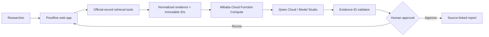

# Proofline Qwen Autopilot

**An evidence-first agent that turns an ambiguous news claim into a human-approved, source-linked public-record report.**

Proofline Qwen Autopilot researches Japanese policy and parliamentary activity end to end. Give it a news URL, formal bill or policy name, or Diet member name. It identifies the research topic, retrieves official National Diet records, asks Qwen to organize only that evidence, validates every returned evidence ID, and pauses for human approval before report export.

The core principle is simple: **an autonomous agent may do the legwork, but it must not manufacture evidence or publish past the reviewer.**

## Why this is an Autopilot Agent

The input is often ambiguous: a headline may use a nickname instead of a formal bill name, mix political claims with facts, or omit the relevant committee. Proofline resolves that ambiguity through a multi-step workflow instead of a single chat response:

1. **Interpret** the URL or phrase and derive a formal research query.
2. **Retrieve** official statements and legislative records with external tools.
3. **Analyze** the retrieved evidence packet with Qwen on Alibaba Cloud Model Studio.
4. **Verify** that every Qwen finding cites a record ID actually retrieved in this run.
5. **Pause** at a human-in-the-loop checkpoint.
6. **Publish** a compact report with original links and unresolved questions.

## What it does

- Accepts a news URL, bill/policy name, or Diet member name
- Finds formal bill names behind headline shorthand
- Searches Japan's National Diet proceedings and House bill records
- Connects questions to subsequent government answers
- Builds timelines, bill-status traces, speaker statistics, and member activity views
- Uses Qwen for an evidence-constrained issue brief
- Drops model findings with missing or invented evidence IDs
- Separates confirmed observations from questions the retrieved record cannot answer
- Requires explicit human approval before report export

## Architecture



See [docs/architecture.md](docs/architecture.md) for the workflow and trust boundaries. The deployable Alibaba Cloud backend is in [alibaba-cloud/function-compute](alibaba-cloud/function-compute).

## Qwen and Alibaba Cloud usage

The production path is:

```text
Next.js research route
  -> Alibaba Cloud Function Compute HTTP trigger
  -> Qwen Cloud OpenAI-compatible Chat Completions
  -> evidence-ID validation
  -> human approval checkpoint
```

Qwen receives only normalized official records with a record ID, speaker, date, committee, chamber, source URL, and text. Its JSON output must cite those IDs. The application validates returned IDs against the retrieved set and removes unsupported findings before display.

If Function Compute is not configured, developers may use the direct Qwen Cloud path locally. If model access is unavailable, official-record discovery still works with a deterministic fallback that is visibly labeled.

## Significant update from the earlier Proofline Japan project

An earlier version of Proofline Japan was submitted to OpenAI Build Week. This Qwen Cloud Hackathon entry is a separate copy and adds substantial new work after the Qwen submission period began:

- Qwen Cloud / Alibaba Cloud Model Studio as the analysis model
- a deployable Alibaba Cloud Function Compute backend
- a visible multi-stage Autopilot run with execution metadata
- deterministic validation of Qwen-returned evidence IDs
- a human approval checkpoint that gates report export
- separate Qwen/Alibaba configuration, architecture documentation, and deployment evidence
- Qwen Autopilot branding and revised submission materials

The earlier OpenAI submission remains frozen at the `openai-build-week-final-2026` tag in its original repository. No OpenAI sponsor integration is used by this Qwen edition.

## Official data sources

- [National Diet Library — Diet Proceedings Search System](https://kokkai.ndl.go.jp/)
- [House of Representatives — Bills](https://www.shugiin.go.jp/internet/itdb_gian.nsf/html/gian/menu.htm)
- [National Diet Library — Index to Japanese Laws and Regulations](https://hourei.ndl.go.jp/)
- [e-Gov Law Search](https://elaws.e-gov.go.jp/)

## Run locally

Requirements: Node.js 22.13 or later.

```bash
npm install
copy .env.example .env.local
npm run dev
```

Configure a Qwen Cloud international API key:

```env
QWEN_API_KEY=your_model_studio_api_key
QWEN_BASE_URL=https://dashscope-intl.aliyuncs.com/compatible-mode/v1
QWEN_MODEL=qwen3.7-plus
```

For the production Alibaba Cloud path, deploy `alibaba-cloud/function-compute` and configure:

```env
ALIBABA_AUTOPILOT_URL=https://your-function-compute-http-trigger
ALIBABA_AUTOPILOT_SECRET=the_same_secret_used_by_the_function
```

Run verification:

```bash
npm test
```

## Suggested demo cases

- `副首都構想` — an ambiguous policy topic with multiple speakers
- `防災庁設置法案` — a proposed agency and its legislative trace
- `高額療養費制度` — policy debate with questions and government answers

## Responsible use

Proofline does not decide whether a political claim is true, replace legal or journalistic judgment, or treat “not found” as “false.” It reports only what was retrieved, preserves source links, exposes unanswered questions, and requires a reviewer before export.

## License

MIT
