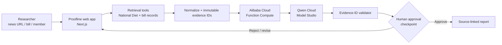

# Proofline Autopilot architecture

## Agent workflow

1. **Interpret** the ambiguous input and identify a formal research query.
2. **Retrieve** official Diet statements and legislative records with deterministic tools.
3. **Analyze** only the retrieved packet with Qwen on Alibaba Cloud Model Studio.
4. **Verify** every model-returned `recordId` against the retrieved set; unsupported findings are dropped.
5. **Pause** at a human approval checkpoint before report export.
6. **Publish** a compact report that keeps original URLs and unanswered questions visible.

The model never controls retrieval results and never receives permission to publish automatically. This makes the Autopilot useful for ambiguous research while retaining a clear human-in-the-loop boundary.

